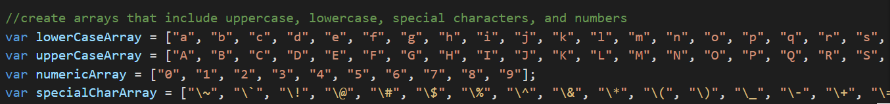

# Password Generator Starter Code

## General Info

In this challenge I was tasked with giving the 'Generate Password' button the ability to generate a password based on criteria the user could select. The password generated needed to be between 8 and 128 characters and be able to include lowercase, uppercase, numeric, and special characters.

## Process of Creating Prompts for Character Length and Character Type

To start off this challenge I needed to connect the button to a starting prompt that would ask the user how many characters they would like their new password to be. I had to set a range of no less than 8 and no more than 128 per the challenge guidelines. To do this, I set up a function of promptLength that would run once to trigger the window prompt and then again when the user plugged in their values. A while loop was used here to make sure the inputted values stayed within the acceptible range and if they were not then a new message would alert the user to try again with an acceptible value. 

To connect the value the user input into the prompt to the password to be generated later on, I created a variable to refer back to the inputted response.

To create the prompts asking the user which character types they would like to include in their password, I created a window confirm for each and then returned the chosen response to be used later. 

Like with the first prompt of character length, I needed to create a variable that the generatePassword function could use to utilize the True/False (OK/Cancel) answers given by the user.

## Handling Arrays

To create the arrays I input them all into a related array variable that would be referred to later during the generatePassword process. 

## Generating the Password

To combine the inputted responses provided by the user needed to generate the new password, I created the function generatePassword with the parameters of the character length and the selected answer of True or False for the options of lowercase, uppercase, numeric, and special character values. This function would then be called back as the finished password once the options were all selected.

To have the values add on to each other as a possibility in the final password, I created the variable named combo that would be the combined set of arrays utilized in the password based on the selections of the user. To have the combo variable add in the necessary arrays I used the input of .push and .apply to add in selections to what was already found in the combo variable.

## Randomizing the Characters

To finish off the challenge I needed to have the chosen characters be chosen at random before being returned to the user. To do this I used a for loop that would continue to apply the Math.random input to each character index until the end of characterLength. I used the input of Math.floor to ensure I was only working with integers.

## Links

Link to Github repository: git@github.com:hvphan1993/Password-Summoner.git

Link to live website: https://hvphan1993.github.io/Password-Summoner/
